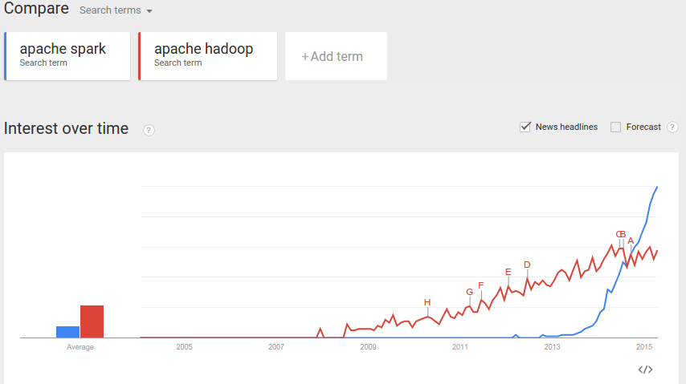
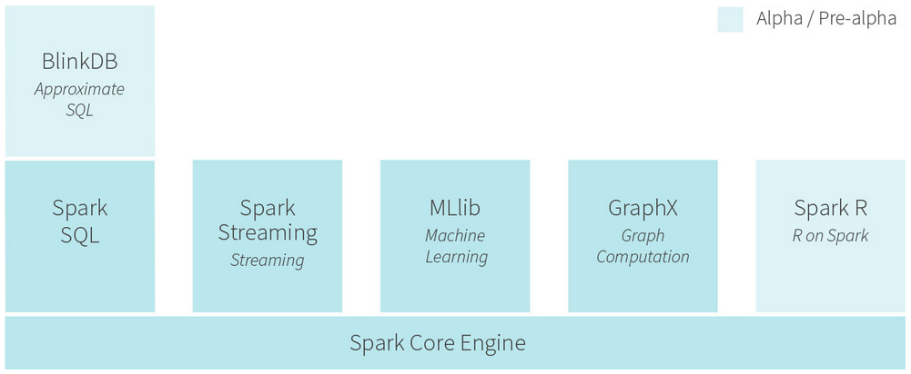
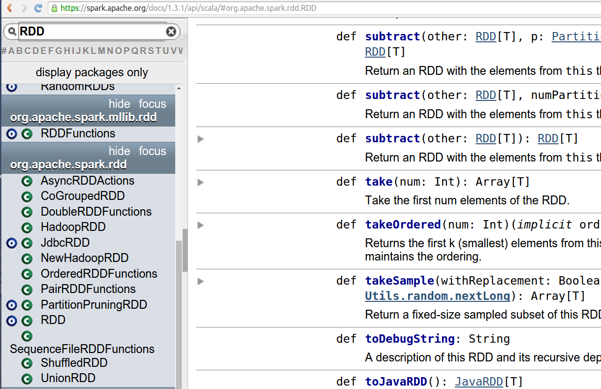
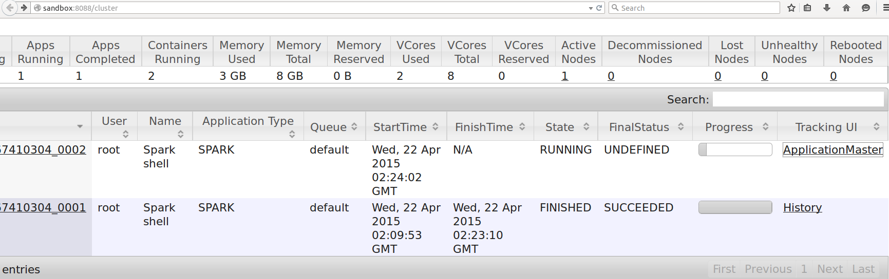
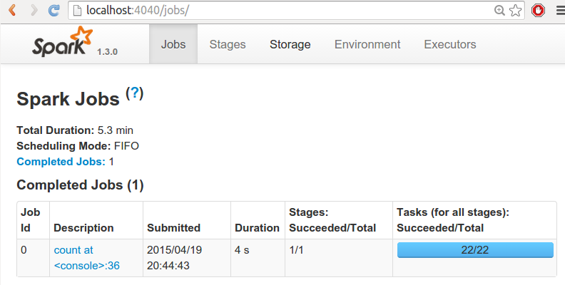

% Adding Spark To Your Hadoop
% Markus Dale
% 2015

# Resources

This presentation, ETL code for email and all example code available
at [https://github.com/medale/spark-mail/](https://github.com/medale/spark-mail/).
Docker Image to run Spark 1.3.1 on Hadoop 2.6 with Enron email sample
data set at https://registry.hub.docker.com/u/medale/spark-mail-docker/.

# Talk Overview
* Hadoop - Spark Comparison
* Resilient Distributed Datasets (RDDs)
* Enron Email with Avro storage
* Analytic: Mail Folder Statistics in Hadoop and Spark
* Spark Installation, running on YARN, Spark Shell
* Spark Web UI
* RDD, PairRDDFunctions, DoubleRDDFunctions
* Resources

# Speaker Background

# Hadoop Ecosystem

* Based on Google GFS (2003)/MapReduce (2004) papers
* Extremely rich and robust

    * ~ 2005 Nutch/2006 Yahoo - Doug Cutting/Mike Cafarella

* HDFS/Hadoop MapReduce batch
* YARN - allows other processing frameworks (like Spark)
* DSLs: Pig, Cascading/Scalding, Crunch, Hive (SQL)
* Graph processing: Giraph
* Real-time streaming: Storm
* Machine Learning: Apache Mahout
...

# Hadoop Challenges

* With rich ecosystem: install, maintain, learn
* MapReduce is batch only - no interactive shell
* Must write out to disk between each iteration
* No general memory caching yet (Apache Tez?)
* Hadoop MapReduce programming is very low-level

    * map phase - (internal shuffle/sort) - reduce phase
    * Progammer expresses logic in map/reduce


# Why Apache Spark?

* Different trade-offs

    * Improved hardware (faster processors, more memory)

* Programmer productivity

    * High-level, scalable processing framework

* Iterative algorithms/ML: Cache interim results
* Interactive data exploration (Spark shell)
* Can run on YARN (or standalone, Mesos)
* read/write HDFS (and many other data sources)

# Apache Spark Buzz


# Apache Spark Unified Large Scale Processing System



# Resilient Distributed Dataset (RDD)

* Treat distributed, immutable data set as a collection
* Resilient: Use RDD lineage to recompute failed partitions
* Two forms of RDD operations:

    * Transformations (applied lazily - optimized evaluation)
    * Actions (cause transformations to be executed)

* Scala, Java, Python APIs (Spark R coming)

    * Rich functions on RDD abstraction

# Enron Email Dataset and Avro MailRecord

* [Enron email dataset from Carnegie Mellon University](https://www.cs.cmu.edu/~./enron/enron_mail_20110402.tgz)
* Nested directories for each user/folder/subfolder
* Emails as text files with headers (To, From, Subject...)
* Over 500,000 files (= 500,000 splits for FileInputFormat)

* Don't want our analytic code to worry about parsing

Solution: Parse to Avro record format, store (MailRecord)

# Why Apache Avro?

* JSON - need to encode binary data
* Hadoop Writable - Java centric

Apache Avro

* Binary serialization framework
* Doug Cutting 2009 (Hadoop, Lucene)
* Language bindings: Java, Scala, C, C++, C#, Python, Ruby
* Schema in file - can use generic or specific processing

[Apache Avro @cutting_doug_apache_2009]

# Avro Container File

* Contains many individual Avro records (~ SequenceFile)
* Schema for each record at the beginning of file
* Supports compression
* Files can be split

# Avro Schema for MailRecord
```
record MailRecord {
  string uuid;
  string from;
  union{null, array<string>} to = null;
  union{null, array<string>} cc = null;
  union{null, array<string>} bcc = null;
  long dateUtcEpoch;
  string subject;
  union{null, map<string>} mailFields = null;
  string body;
  union{null, array<Attachment>} attachments = null;
}
```

# Analytic: Mail Folder Statistics
* What are the least/most/average number of folders per user?
* Each MailRecord has user name and folder name

```

lay-k/    <- mailFields(UserName)
business  <- mailFields(FolderName)
family
enron
inbox
...
```

# Hadoop Mail Folder Stats - Mapper

* read each mail record

    * AvroKey(MailRecord), NullWritable

* emits key: Text(userName), value: Text(folderName)

# Hadoop Mail Folder Stats - Reducer

* reduce method

    * create set from values for a given key (unique folder names per user)
    * set.size == folder count
    * keep adding up all set.size (totalNumberOfFolders)
    * one up counter for each key (totalUsers)
    * keep track of min/max count

* cleanup method

    * compute average for this partition: totalNumberOfFolders/totalUsers
    * write out min, max, totalNumberOfFolders, totalUsers, avgPerPartition

# Hadoop Mail Folder Stats - Driver
* Set AvroKeyInputFormat, key schema
* Number of reducers
* OutputFormat
* See https://github.com/medale/spark-mail/blob/master/hadoop-example/src/main/java/com/uebercomputing/hadoop/FolderAnalyticsDriver.java

# Spark Installation
* Download binary tgz from Apache Spark (match Hadoop version)
* Untar on edge node (requires java)
* Set HADOOP_CONF_DIR environment variable or $SPARK_HOME/conf/spark-env.sh
* Or

    * Bundled with Cloudera, Hortonworks, MapR distros...

# Running Spark on YARN
* https://spark.apache.org/docs/1.3.1/running-on-yarn.html
* Driver, Executors (SparkApplicationMaster)
* Submit jobs to YARN Resource Manager

    * spark-submit --master yarn-cluster/yarn-client

* Or run as interactive shell

# Spark Interactive Shell
```bash
/usr/local/spark/bin/spark-shell \
  --master yarn-client --driver-memory 1G \
  --executor-memory 1G --num-executors 1 \
  --executor-cores 1 \
  ... (Kryo serialization/logging)
  --jars /root/mailrecord-utils-1.0.0-shaded.jar
```

# Brief Scala Background - map function on collections

* map: applies a given function to every element of a collection
* returns collection of output of that function

    * one per original element

* List[A]:

    * map(f: (A) => B): List[B]
    * Note: List[A].size == List[B].size

# map - Scala
```scala
def computeLength(w: String): Int = w.length

val words = List("when", "shall", "we", "three",
  "meet", "again")
> words: List[String] = List(when, shall, we, three,
     meet, again)

val lengths = words.map(computeLength)
> lengths  : List[Int] = List(4, 5, 2, 5, 4, 5)
```

# map - Scala syntactic sugar
```scala
//functions are first class objects
val f = (w: String) => w.length
val list1 = words.map(f)

//anonymous function (specifying input arg type)
val list2 = words.map((w: String) => w.length)

//let compiler infer arguments type
val list3 = words.map(w => w.length)

//use positionally matched argument
val list4 = words.map(_.length)
```

# Option
* NPE - NullPointerException no more!
* Used instead of null
* If something declared as Option[T]

    * Some[T] or singleton object None

* Can be treated as a collection

# flatMap

```scala
For List[A]

flatMap[B](f: (A) =>
    GenTraversableOnce[B]): List[B]
```

* GenTraversableOnce - List, Array, Option...
* can be empty collection or None
* flatMap takes each element in the GenTraversableOnce and puts it in
order to output List[B]

  * removes inner nesting - flattens
  * output list can be smaller or empty (if intermediates were empty)

# flatMap Example
```scala
val macbeth = """When shall we three meet again?
|In thunder, lightning, or in rain?""".stripMargin
val macLines = macbeth.split("\n")
// macLines: Array[String] = Array(
  When shall we three meet again?,
  In thunder, lightning, or in rain?)

//Non-word character split
val macWordsNested: Array[Array[String]] =
      macLines.map{line => line.split("""\W+""")}
//Array(Array(When, shall, we, three, meet, again),
//      Array(In, thunder, lightning, or, in, rain))

val macWords: Array[String] =
     macLines.flatMap{line => line.split("""\W+""")}
//Array(When, shall, we, three, meet, again, In,
//      thunder, lightning, or, in, rain)
```

# Scala Tuples - key/value pairs
```scala
> val tuple = ("key", "value")
tuple: (String, String) = (key,value)

> tuple._1
res0: String = key

> tuple._2
res2: String = value

> val (key,value) = tuple
key: String = key
value: String = value

> Some(tuple)
> None
```
# Spark - SparkContext
* Automatically created by shell

    * In 1.3.1. variable names: sc, sqlContext

* Or created with SparkConf for submitting a job
* input from HDFS or local file system (Hadoop API, textFile...)
* accumulator and broadcast variables

    * ~ Hadoop counters/distributed cache

# Spark - RDD API
* [RDD API](http://spark.apache.org/docs/1.3.0/api/scala/index.html#org.apache.spark.rdd.RDD)
* Transforms - map, flatMap, filter, reduce, fold...

    * Lazy evaluation (not evaluated until action! Optimizations)

* Actions - count, collect, first, take, saveAsTextFile...
* Also PairRDDFunctions, DoubleRDDFunctions, OrderedRDDFunctions

# RDD Scaladocs



# Spark Shell - import required classes
```scala
scala> :paste
import org.apache.spark.rdd._
import org.apache.avro.mapred.AvroKey
import org.apache.avro.mapreduce.AvroKeyInputFormat
import org.apache.hadoop.io.NullWritable
import com.uebercomputing.mailrecord._
import com.uebercomputing.mailrecord.Implicits.mailRecordToMailRecordOps
import com.uebercomputing.mailparser.enronfiles.AvroMessageProcessor

Ctrl-D
```

# Shell Command Completion, History, Exit
* $VAR_NAME. + TAB - shows available methods
* Up/down scroll through command history
* exit - to shut down Spark Shell

# Reading enron.avro as MailRecord
```scala
val hadoopConf = sc.hadoopConfiguration

val mailRecordsAvroRdd =
  sc.newAPIHadoopFile("enron.avro",
  classOf[AvroKeyInputFormat[MailRecord]],
  classOf[AvroKey[MailRecord]],
  classOf[NullWritable], hadoopConf)
> RDD[(AvroKey[MailRecord], NullWritable)]
```

# Convert to RDD with just MailRecords via map
```scala
val recordsRdd = mailRecordsAvroRdd.map {
     tuple => tuple._1.datum()
}

Or

val recordsRdd = mailRecordsAvroRdd.map {
    case(avroKey, _) => avroKey.datum()
}
> RDD[MailRecord]
```

# Extract userName/folderName Tuples
```scala
val tupleRdd: RDD[(String,String)] =

 recordsRdd.flatMap { mailRecord =>
  val userNameOpt =
     mailRecord.getMailFieldOpt(
       AvroMessageProcessor.UserName)
  val folderNameOpt =
     mailRecord.getMailFieldOpt(
       AvroMessageProcessor.FolderName)

  if (userNameOpt.isDefined &&
    folderNameOpt.isDefined) {
    Some((userNameOpt.get,
      folderNameOpt.get))
    } else {
      None
    }
 }
```

# Caching and Action
```scala
tupleRdd.cache()

tupleRdd.count()
tupleRdd.count()
```

# Spark Web UI - Resource Manager


# Spark Web UI - Tour


# Spark - From RDD to PairRDDFunctions

* If an RDD contains tuples (K,V) - can apply PairRDDFunctions
* Uses implicit conversion of RDD to PairRDDFunctions
* In 1.3 conversion is defined in RDD singleton object
* In 1.2 and previous versions available by importing
org.apache.spark.SparkContext._

```scala
From 1.3.0 org.apache.spark.rdd.RDD (object):

implicit def rddToPairRDDFunctions[K, V](rdd: RDD[(K, V)])
(implicit kt: ClassTag[K], vt: ClassTag[V],
  ord: Ordering[K] = null): PairRDDFunctions[K, V] = {
  new PairRDDFunctions(rdd)
}

```

# PairRDDFunctions API
* keys, values - return RDD of keys/values
* mapValues - transform each value with a given function
* flatMapValues - flatMap each value (0, 1 or more output per value)
* groupByKey - RDD[(K, Iterable[V])]

    * Note: expensive for aggregation/sum - use reduce/aggregateByKey!

* reduceByKey - return same type as value type
* foldByKey - zero/neutral starting value
* aggregateByKey - can return different type
* lookup - retrieve all values for a given key
* join (left/rightOuterJoin), cogroup
...

# Sets of folderNames per user
```scala
//pre Spark 1.3.0: import org.apache.spark.SparkContext._
import scala.collection.mutable.{ Set => MutableSet }

//mutable set - reduce object creation/garbage collection
val uniqueFoldersByUserRdd:
RDD[(String, MutableSet[String])] =
 tupleRdd.aggregateByKey(MutableSet[String]())(
    seqOp = (folderSet, folder) => folderSet + folder,
    combOp = (set1, set2) => set1 ++ set2)
> RDD[(String, Set[String])] = ShuffledRDD
```

# Just the Set Size please
```scala
val foldersPerUserRdd: RDD[(String, Int)] =
  uniqueFoldersByUserRdd.mapValues { set => set.size }
> RDD[(String, Int)]
```

# Exploring a data set
```scala
>foldersPerUserRdd.first()
res7: (String, Int) = (beck-s,135)

//WARNING: Brings it all back to driver!
>foldersPerUserRdd.collect()

>foldersPerUserRdd.count()
>foldersPerUserRdd.take(3)

>foldersPerUserRdd.max()(Ordering.by(_._2))
res11: (String, Int) = (kean-s,193)

>foldersPerUserRdd.min()(Ordering.by(_._2))
res12: (String, Int) = (harris-s,2)

> foldersPerUserRdd.sample(false, 0.1)
```

# From RDD to DoubleRDDFunctions

* From API docs: "Extra functions available on RDDs of Doubles through an
  implicit conversion."

* mean, stddev, stats (count, mean, stddev, min, max)
* sum
* histogram
...

# DoubleRDDFunctions - Stats

```scala
val folderCounts: RDD[Int] =
   foldersPerUserRdd.values

val stats = folderCounts.stats()
> stats: org.apache.spark.util.StatCounter =
(count: 40, mean: 30.050000, stdev: 37.856935,
 max: 193.000000, min: 2.000000)

//buckets 0-25, 25-50 etc.
val buckets = Array(0.0,25,50,75,100,125,150,175,200)
folderCounts.histogram(buckets, evenBuckets=true)
res21: Array[Long] = Array(26, 5, 6, 1, 0, 1, 0, 1)
```

# RDD Lineage - transformations
```scala
folderCounts.toDebugString
> res18: String =
(22) MappedRDD[27] at values at <console>:35 []
|   MappedValuesRDD[26] at mapValues at <console>:33 []
|   ShuffledRDD[25] at aggregateByKey at <console>:31 []
+-(22) FlatMappedRDD[2] at flatMap at <console>:26 []
|       CachedPartitions: 22; MemorySize: 76.3 MB;
         TachyonSize: 0.0 B; DiskSize: 0.0 B
|   MappedRDD[1] at map at MailRecordAnalytic.scala:48 []
|   NewHadoopRDD[0] at newAPIHadoopRDD at
         MailRecordAnalytic.scala:94 []
```

# Hadoop InputFormats - Minimize object creation!
* WARNING: Hadoop InputFormats generally reuse the key/value objects
* Same with AvroKeyInputFormat
* Generally, not a problem if you just map out the fields you need (getFrom etc.)
* However, if you want to cache the whole MailRecord you need to copy the original:
```scala
val mailRecordsRdd = mailRecordsAvroRdd.map {
  case (mailRecordAvroKey, fileSplit) =>
    val mailRecord = mailRecordAvroKey.datum()
    //make a copy - MailRecord gets reused!!!
    MailRecord.newBuilder(mailRecord).build()
  }
```

# Questions?

# Backup Slides

# Hadoop Mapper
```java
public void map(AvroKey<MailRecord> key,
NullWritable value,
Context context) throws ... {
  MailRecord mailRecord = key.datum();
  Map<String, String> mailFields =
  mailRecord.getMailFields();
  String userNameStr = mailFields.get("UserName");
  String folderNameStr = mailFields.get("FolderName");
  if (userNameStr != null && folderNameStr != null) {
    userName.set(userNameStr);
    folderName.set(folderNameStr);
    context.write(userName, folderName);
  }
}
```

# Hadoop Reducer - reduce
```java
public void reduce(Text userName,
Iterable<Text> folderNames,
Context context) throws ... {
  Set<String> uniqueFoldersPerUser = new HashSet<String>();
  for (Text folderName : folderNames) {
    uniqueFoldersPerUser.add(folderName.toString());
  }
  int count = uniqueFoldersPerUser.size();
  if (count > maxCount) {
    maxCount = count;
    maxUserName = userName.toString();
  }
  if (count < minCount) {
    minCount = count;
  }
  totalNumberOfFolders += count;
  totalUsers++;
}
```

# Hadoop Reducer - cleanup
```java
@Override
public void cleanup(Context context) throws ... {
  double avgFolderCountPerPartition =
  totalNumberOfFolders / totalUsers;

  String resultStr = "AvgPerPart=" +
  avgFolderCountPerPartition +
  "\tTotalFolders=" +
  totalNumberOfFolders +
  + "\tTotalUsers=" +
  totalUsers +
  "\tMaxCount=" +
  maxCount +
  "\tMaxUser=" + maxUserName +
  "\tMinCount=" + minCount;
  Text resultKey = new Text(resultStr);
  context.write(resultKey, NullWritable.get());
}
```

# Hadoop Driver
```java
FileInputFormat.addInputPath(job, new Path("enron.avro"));
FileOutputFormat.setOutputPath(job,
  new Path("folderAnalytics"));

  job.setInputFormatClass(AvroKeyInputFormat.class);
  job.setMapperClass(FolderAnalyticsMapper.class);
  job.setReducerClass(FolderAnalyticsReducer.class);

  job.setNumReduceTasks(1);
  AvroJob.setInputKeySchema(job,
    MailRecord.getClassSchema());

    job.setMapOutputKeyClass(Text.class);
    job.setMapOutputValueClass(Text.class);

    job.setOutputFormatClass(TextOutputFormat.class);
    ```

# References {.allowframebreaks}
