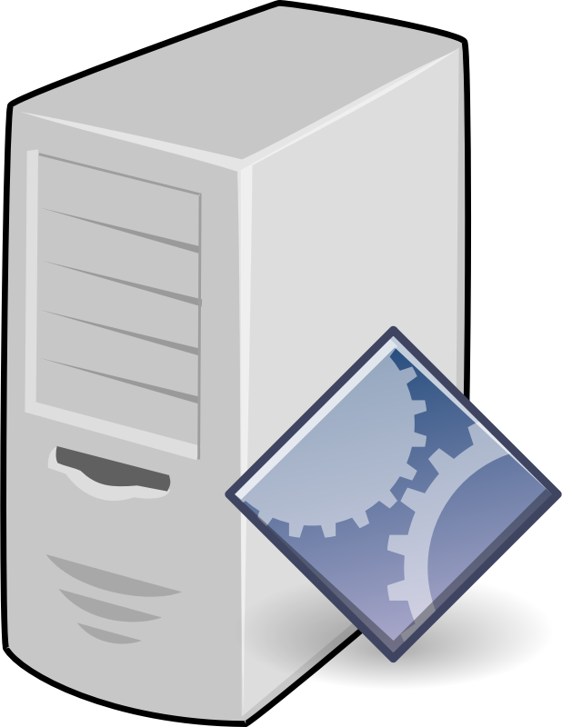
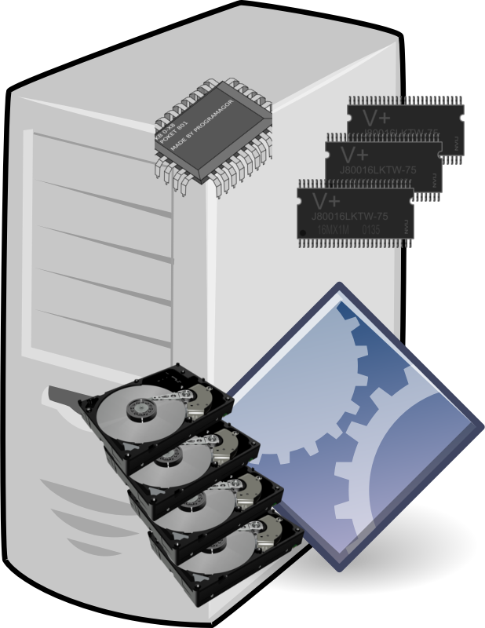
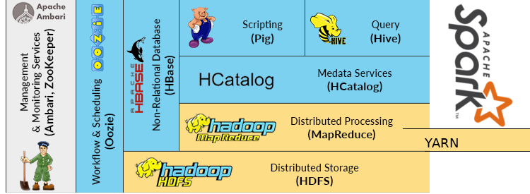
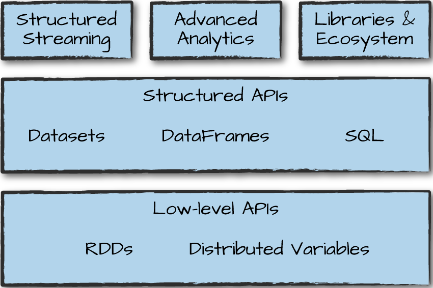
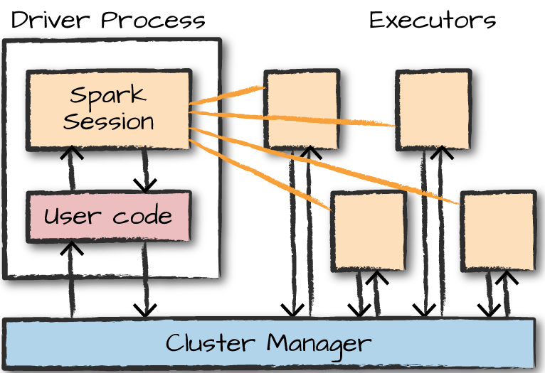
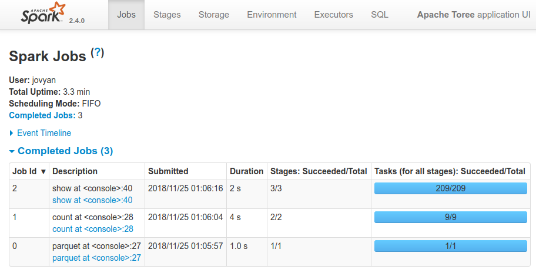
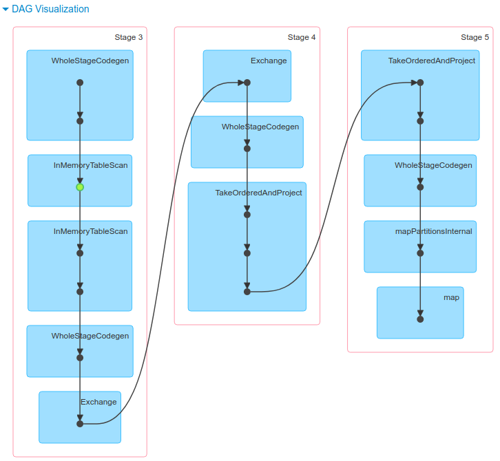
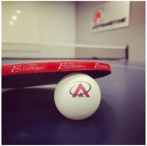

% Apache Spark Through Email
% Markus Dale
% Nov 2018

# Slides And Code
* Slides: https://github.com/medale/spark-mail/blob/master/presentation/ApacheSparkThroughEmail.pdf
* Spark Code Examples: https://github.com/medale/spark-mail/

# Data Science for Small Dataset

# Data Science for Larger Dataset

# Data Science for Larger Dataset (Vertical Scaling)

# Data Science for Large Datasets (Horizontal Scaling)

# Big Data Framework - Apache Hadoop

# Hadoop Ecosystem

# Apache Spark Components

\tiny Source: Spark: The Definitive Guide

# Hello, Email World!
* Jupyter Notebook with Apache Toree
* See [ApacheSparkThroughEmail1](../notebooks/html/ApacheSparkThroughEmail1.html)

# A Spark Application - Driver, Executors, Tasks, Cluster Managers

\tiny Source: Spark: The Definitive Guide

# DataFrameReader: Built-in Data Formats
* [spark.sql.SparkSession](https://spark.apache.org/docs/latest/api/scala/index.html#org.apache.spark.sql.SparkSession)
* [spark.sql.DataFrameReader](https://spark.apache.org/docs/latest/api/scala/index.html#org.apache.spark.sql.DataFrameReader)
     * jdbc
     * json
     * parquet
     * text...
     * Also: https://spark-packages.org - Avro, Redshift, MongoDB...

# Scaling Behind the Scenes

# Combining work per stage - shuffle

# Where clause, Column methods, Built-in functions

* See [Apache Spark Through Email Notebook 2](../notebooks/html/ApacheSparkThroughEmail2.html)

# Parallelism and Partitioning

* Initial parallelism - number of input "blocks"
* Shuffle - `spark.`

# Colon Cancer
* Screening saves lives! {width=100px}
     * Colonoscopy - talk to your doc
* [Colorectal Cancer Alliance](https://www.ccalliance.org/)

# Questions?

