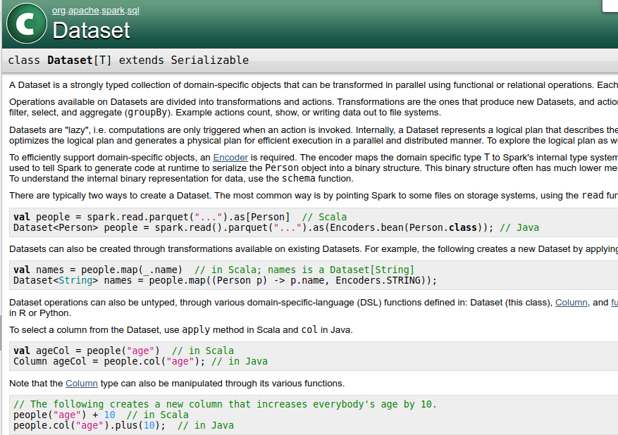
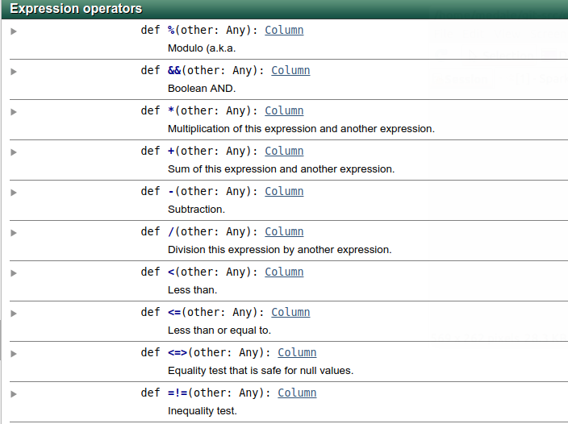
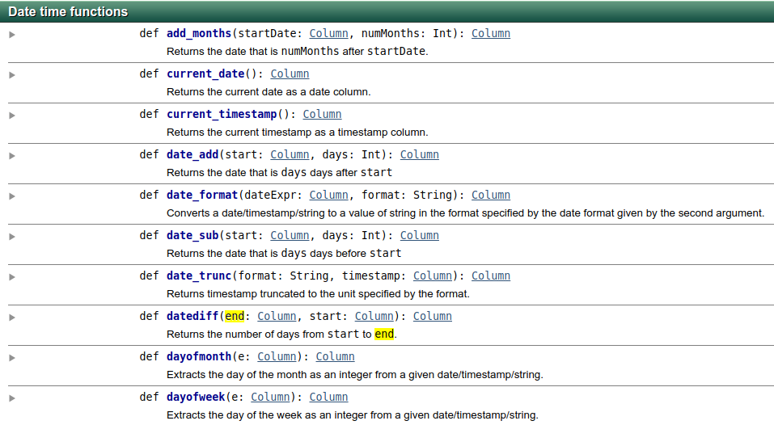

% Apache Spark Through Email
% Markus Dale, medale@asymmetrik.com
% July 2024

# Intro, Slides And Code
* Slides: https://github.com/medale/spark-mail/blob/master/presentation/ApacheSparkThroughEmail.pdf
* Spark Code Examples: https://github.com/medale/spark-mail/
     * README.md describes how to get and parse Enron email dataset


# Goals


# Data Science for Small Dataset


# Data Science for Larger Dataset (Vertical Scaling)

{height=80%}


# Data Science for Large Datasets (Horizontal Scaling)


# Big Data Framework - Apache Hadoop


# Hadoop Ecosystem


# Apache Spark API
* Scala
* Java
* Python
* R
* => Project Tungsten code generation

# Apache Spark Components


\tiny Source: Spark: The Definitive Guide


# Hello, Spark Email World!
* Jupyter Notebook with Apache Toree
* See [Notebook ../notebooks/html/ApacheSparkThroughEmail1.html](https://medale.github.io/spark-mail/notebooks/html/ApacheSparkThroughEmail1.html)


# Cluster Manager, Driver, Executors, Tasks


\tiny Source: Apache Spark website


# SparkSession: Entry to cluster
* `spark`: [spark.sql.SparkSession](https://spark.apache.org/docs/latest/api/scala/index.html#org.apache.spark.sql.SparkSession)

```scala
//SparkSession provided by notebook or shell as spark
val homeDir = sys.props("user.home")
val records = spark.read.
   parquet(s"$homeDir/datasets/enron/enron-small.parquet")

//In regular code for spark-submit 
//com.uebercomputing.spark.dataset.TopNEmailMessageSenders
val spark = SparkSession.builder().
   appName("TopNEmailMessageSenders").
   master("local[2]").getOrCreate()
```

# DataFrameReader: Input for structured data
* `spark.read`: [spark.sql.DataFrameReader](https://spark.apache.org/docs/latest/api/scala/index.html#org.apache.spark.sql.DataFrameReader)
     * jdbc
     * json
     * parquet
     * text...
     * Also: https://spark-packages.org - Avro, Redshift, MongoDB...

# Transformations vs. Actions
* Transformation: returns a new RDD (nothing gets executed)
     * `read`, `cache`, `filter`...
* Actions: trigger execution, catalyst query optimizer, Tungsten code generation
     * `count`, `write`, `
* 
# Scaling Behind the Scenes


# Stages: Pipeline work per stage - shuffle

{height=80%}


# Where clause, Column methods, Built-in functions

* See [Notebook ../notebooks/html/ApacheSparkThroughEmail2.html](https://medale.github.io/spark-mail/notebooks/html/ApacheSparkThroughEmail2.html)


# Spark APIs - DataFrameReader, Dataset, Column, functions

{height=40%}\ {height=40%}
{height=40%}\ {height=40%}


# Parallelism and Partitioning
* Goldilocks - not too many, not too few
* Initial parallelism - number of input "blocks"
* Shuffle - `spark.sql.shuffle.partitions` configuration


# Explode, Shuffle Partitions, UDF, Parquet partition

*  See [Notebook ../notebooks/html/ApacheSparkThroughEmail3.html](https://medale.github.io/spark-mail/notebooks/html/ApacheSparkThroughEmail3.html)


# Apache Parquet/Apache Arrow
* Avro - record-oriented data format
* Parquet - column-oriented data format by page
* Arrow - share memory for Python (https://spark.apache.org/docs/latest/api/python/user_guide/sql/arrow_pandas.html)

# And now for something completely different: Colon Cancer
* Screening saves lives! {width=100px}
     * Colonoscopy - talk to your doc
* [Colorectal Cancer Alliance](https://www.ccalliance.org/)


# Questions?

{width=100px}\ {width=100px}

* markus.dale@bluehalo.com
* [Infrequent blog/past presentations http://uebercomputing.com/](http://uebercomputing.com/)
* [Spark Mail repo https://github.com/medale/spark-mail/](https://github.com/medale/spark-mail)
