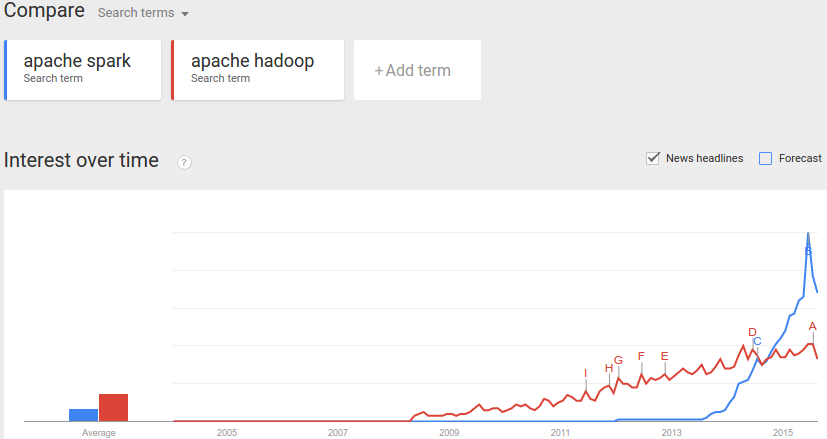
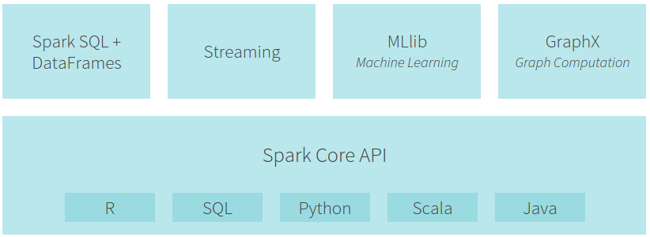
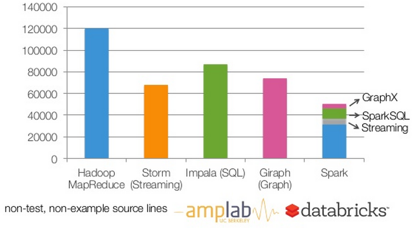
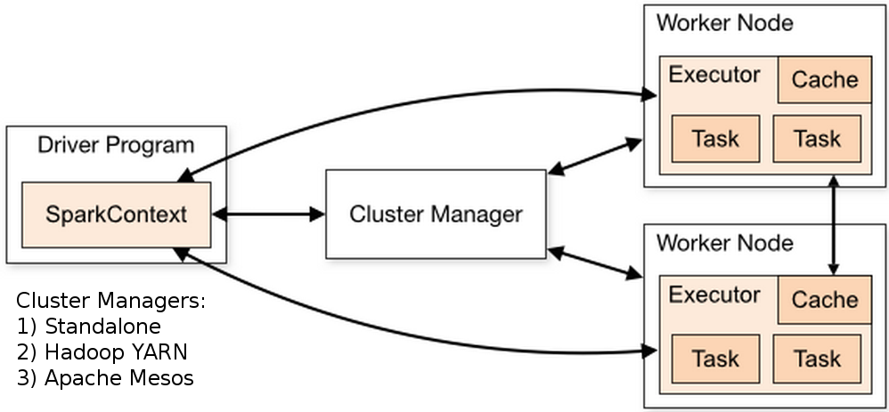

% Apache Spark - The Scala Killer App?
% Markus Dale
% 2015

# Slides And Code
* Slides: https://github.com/medale/spark-mail/blob/master/presentation/Spark-ScalaKillerApp.pdf
* Spark Code Examples: https://github.com/medale/spark-mail/

# What's Apache Spark?
* Large-scale data processing framework written in Scala
* Replacement for Hadoop MapReduce?

    * In-memory caching
    * Advanced directed acyclic graph of computations - optimized
    * Rich high-level Scala, Java, Python and R APIs
        * 2-5x less code than Hadoop M/R

* Unified batch, SQL, streaming, graph and machine learning

# Apache Spark Buzz


# Spark Ecosystem


# Spark Lines of Code


# Spark Academic Papers
* Spark: Cluster computing with working sets [@zaharia_spark_2010]
* Resilient Distributed Datasets: A fault-tolerant abstraction for in-memory cluster computing [@zaharia_resilient_2012]
* GraphX: A Resilient Distributed Graph System on Spark [@xin_graphx_2013]
* Spark SQL: Relational data processing in Spark [@armbrust_spark_2015]
* MLlib: Machine Learning in Apache Spark [@meng_mllib_2015]

# Spark Clusters


# Getting Spark

* http://spark.apache.org/downloads.html
    * Source
    * Pre-built binaries for multiple versions of Hadoop
* Standalone - run local (1 node) or slaves file
* Hadoop YARN - install on cluster edge node, HADOOP_CONF_DIR
* Apache Mesos
* Hortonworks Data Platform - HDP includes Spark
* Cloudera...

# Spark in the Cloud
* Amazon EC2 deploy script - standalone cluster/S3
* Amazon Elastic MapReduce (EMR) - Spark install option
* Google Compute Engine - Hadoop/Spark
* Databricks Spark Clusters - Notebooks, Jobs, Dashboard

# Resilient Distributed Dataset (RDD)

* Treat distributed, immutable data set as a collection
    * Lineage - remember origin and transformations

* Resilient: recompute failed partitions using lineage

* Two forms of RDD operations:

    * Transformations (applied lazily - optimized evaluation)
    * Actions (cause transformations to be executed)

* Rich functions on RDD abstraction [@zaharia_resilient_2012]

# RDD from Hadoop Distributed File System (HDFS)


# Scala Collection Combinators

* Examples: map, flatMap, filter, reduce...

# map

* applies a given function to every element of a collection
* returns collection of output of that function (one per original element)
* input argument - same type as collection type
* return type - can be any type

# map - Scala
```scala
def computeLength(w: String): Int = w.length

val words = List("when", "shall", "we", "three",
  "meet", "again")
val lengths = words.map(computeLength)

> lengths  : List[Int] = List(4, 5, 2, 5, 4, 5)
```

# map - Scala syntactic sugar
```scala
//anonymous function (specifying input arg type)
val list2 = words.map((w: String) => w.length)


//let compiler infer arguments type
val list3 = words.map(w => w.length)


//use positionally matched argument
val list4 = words.map(_.length)
```

# flatMap
* apply a function to every element
* Output of applying function to each element is a "collection"
    * Could be empty
    * Could have 1 to many output elements
* flatten - take each element in output "collection" and copy it to overall output
    * remove one level of nesting (flatten)

# flatMap Example
```scala
val macbeth = """When shall we three meet again?
|In thunder, lightning, or in rain?""".stripMargin
val macLines = macbeth.split("\n")
// macLines: Array[String] = Array(
  When shall we three meet again?,
  In thunder, lightning, or in rain?)

//Non-word character split
val macWordsNested: Array[Array[String]] =
      macLines.map{line => line.split("""\W+""")}
//Array(Array(When, shall, we, three, meet, again),
//      Array(In, thunder, lightning, or, in, rain))

val macWords: Array[String] =
     macLines.flatMap{line => line.split("""\W+""")}
//Array(When, shall, we, three, meet, again, In,
//      thunder, lightning, or, in, rain)
```

# filter
```scala
List[A]
...
def filter(p: (A) => Boolean): List[A]
```
* selects all elements of this list which satisfy a predicate.
* returns - a new list consisting of all elements of this list that satisfy the
          given predicate p. The order of the elements is preserved.

# filter Example
```scala
val macWordsLower = macWords.map{_.toLowerCase}
//Array(when, shall, we, three, meet, again, in, thunder,
//      lightning, or, in, rain)

val stopWords = List("in","it","let","no","or","the")
val withoutStopWords =
  macWordsLower.filter(word => !stopWords.contains(word))
// Array(when, shall, we, three, meet, again, thunder,
//       lightning, rain)
```

# So what does this have to do with Apache Spark?
* Resilient Distributed Dataset ([RDD](https://spark.apache.org/docs/1.4.1/api/scala/#org.apache.spark.rdd.RDD))
* From API docs: "immutable, partitioned collection of elements that can be operated on in parallel"
* map, flatMap, filter, reduce, fold, aggregate...

# com.uebercomputing.analytics.basic.BasicRddFunctions
```scala
//compiler can infer bodiesRdd type - reader clarity
val bodiesRdd: RDD[String] =
  analyticInput.mailRecordRdd.map { record =>
  record.getBody
}
val bodyLinesRdd: RDD[String] =
  bodiesRdd.flatMap { body => body.split("\n") }
val bodyWordsRdd: RDD[String] =
  bodyLinesRdd.flatMap { line => line.split("""\W+""") }
val stopWords = List("in", "it", "let", "no", "or", "the")
val wordsRdd = bodyWordsRdd.filter(!stopWords.contains(_))

//Lazy eval all transforms so far - now action!
println(s"There were ${wordsRdd.count()} words.")
```

# Spark - RDD API
* [RDD API](http://spark.apache.org/docs/1.3.0/api/scala/index.html#org.apache.spark.rdd.RDD)
* Transforms - map, flatMap, filter, reduce, fold, aggregate...

    * Lazy evaluation (not evaluated until action! Optimizations)

* Actions - count, collect, first, take, saveAsTextFile...

# Spark - From RDD to PairRDDFunctions
* If an RDD contains tuples (K,V) - can apply PairRDDFunctions
* Uses implicit conversion of RDD to PairRDDFunctions
* In 1.3 conversion is defined in RDD singleton object
* In 1.2 and previous versions available by importing
org.apache.spark.SparkContext._

```scala
From 1.3.0 org.apache.spark.rdd.RDD (object):

implicit def rddToPairRDDFunctions[K, V](rdd: RDD[(K, V)])
(implicit kt: ClassTag[K], vt: ClassTag[V],
  ord: Ordering[K] = null): PairRDDFunctions[K, V] = {
  new PairRDDFunctions(rdd)
}

```

# PairRDDFunctions
* keys, values - return RDD of keys/values
* mapValues - transform each value with a given function
* flatMapValues - flatMap each value (0, 1 or more output per value)
* groupByKey - RDD[(K, Iterable[V])]

    * Note: expensive for aggregation/sum - use reduce/aggregateByKey!

* reduceByKey - return same type as value type
* foldByKey - zero/neutral starting value
* aggregateByKey - can return different type
* lookup - retrieve all values for a given key
* join (left/rightOuterJoin), cogroup
...

# From RDD to DoubleRDDFunctions

* From API docs: "Extra functions available on RDDs of Doubles through an
  implicit conversion."

* mean, stddev, stats (count, mean, stddev, min, max)
* sum
* histogram
...

# Spark Web UI - Tour


# Learning Resources
* https://github.com/medale/spark-mail
* https://github.com/medale/spark-mail-docker
* O'Reilly: Learning Spark, Advanced Analytics with Spark
* EdX:
    * Introduction to Big Data with Apache Spark
    * Scalable Machine Learning
* Coursera: 2 Scala MOOCs by Martin Odersky
* Databricks: https://databricks.com/spark/developer-resources

# References {.allowframebreaks}
