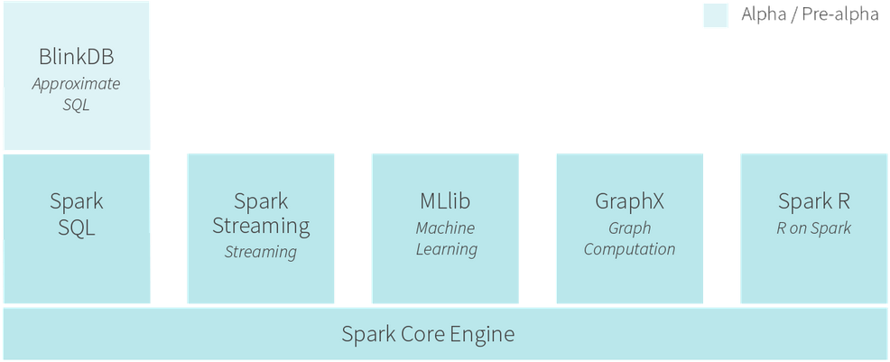
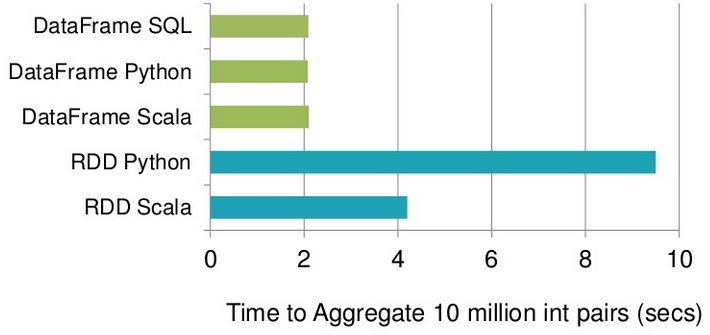
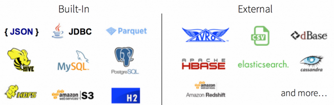
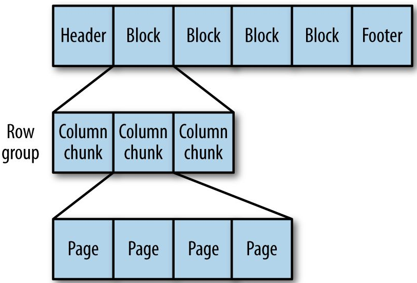

% Apache Spark DataFrames
% Markus Dale
% 2015

# Spark Ecosystem



# Spark SQL

* Structured/semi-structured data on Spark
* Can write SQL-like queries or
* DataFrame DSL language
* Michael Armbrust (Databricks Spark SQL lead):

    * Write less code
    * Read less data
    * Let [Catalyst query] optimizer do the hard work

# Emails per user - RDD
```
val mailRecordsAvroRdd =
  sc.newAPIHadoopFile("enron.avro",
        classOf[AvroKeyInputFormat[MailRecord]],
        classOf[AvroKey[MailRecord]],
        classOf[NullWritable], hadoopConf)
val recordsRdd = mailRecordsAvroRdd.map {
  case (avroKey, _) => avroKey.datum()
}
val emailsPerUserRdd =
    recordsRdd.flatMap(mailRecord => {
      val userNameOpt =
        mailRecord.getMailFieldOpt("UserName")
      if (userNameOpt.isDefined) Some(userNameOpt.get, 1)
      else None
    }).reduceByKey(_ + _).
    sortBy(((t: (String, Int)) => t._2),
         ascending = false)
```

# Emails per user - DataFrame
```
import org.apache.spark.sql.functions.udf
//Databricks spark-avro from spark-packages.org
val recordsDf = sqlContext.avroFile("enron.avro")

val getUserUdf = udf((mailFields: Map[String, String])
               => mailFields("UserName"))

import sqlContext.implicits._
val recordsWithUserDf =
  recordsDf.withColumn("user",
       getUserUdf($"mailFields"))
recordsWithUserDf.groupBy("user").
  count().
  orderBy($"count".desc)
```

# Spark SQL in Context

* Complete re-write/superset of Shark announced April 2014
* Not [Hive on Spark](https://issues.apache.org/jira/browse/HIVE-7292)
* Leverages Spark Core infrastructure/RDD abstractions
* Separate library (in addition to Spark Core): spark-sql, spark-hive

# DataFrame

* Introduced in Spark 1.3 March 2015 (presentation uses 1.4.0)
* Replacement/evolution of SchemaRDD
* Inspired by data frames in [Python Data Analysis (pandas)](http://pandas.pydata.org/) and
[R](http://www.r-project.org/)
* Distributed collection of Row objects (with known schema/columns)
* Abstractions for selecting, filtering, aggregation

# Catalyst Query Optimizer Pipeline


# DataFrame Speed Up - Catalyst Query Optimizer



# Spark SQL Data Sources



# Spark Packages

* Aggregator site for third party Spark packages (http://spark-packages.org)
* spark-avro
* spark-redshift
* couchbase-spark-connector
* 10 more entries (as of June 21, 2015)

# Apache Parquet

* Columnar storage format - store data by chunks of columns rather than rows
* Support complex nesting using algorithms from [Google Dremel @melnik_dremel_2010].
* See [Apache Parquet docs @parquet_apache_2014]

# Parquet File Structure



# DataFrameReader (1.4)

```
val emails =
  sqlContext.read.format("parquet").load("enron.parquet")
//.read.parquet/json/jdbc

val rolesDf = sqlContext.read.
   format("com.databricks.spark.csv").
   option("header", "true").
   load("roles.csv")
```

# DataFrameWriter (1.4)

```
emailsWithYearDf.write.format("parquet").
  partitionBy("year").
  save("/opt/rpm1/enron/parquet/out")

//year=0001  year=1986 ... year=2044
//part-r-00001.gz.parquet in each
```


# References {.allowframebreaks}
